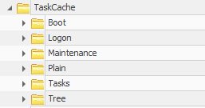
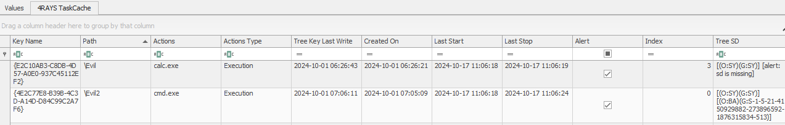

# 4RAYS TaskCache RE plugin

Plugin for Eric Zimmerman's [Registry Explorer](https://ericzimmerman.github.io/), 
that allows you to view more TaskCache key values than are available by default.

To install, place plugin dll file `RegistryPlugin.4RAYS.TaskCache.dll` in directory `.\RegistryExplorer\Plugins\`.

`RegistryPluginBase` project is taken from Eric's [repository](https://github.com/EricZimmerman/RegistryPlugins/tree/master/RegistryPluginBase).

# How to use
Open TaskCache key from `SOFTWARE` hive: `Microsoft\Windows NT\CurrentVersion\Schedule\TaskCache` (available in bookmarks by default).

You will see the columns in the table:
1) Key Name – task GUID;
2) Path – path in tree;
3) Actions – enumeration of commandlines that task performs;
4) Actions Type – enumeration of types of actions that are used in task;
5) Tree Key Last Write – timestamp of modification of task key in tree;
6) Created On - value from DynamicInfo;
7) Last Start - value from DynamicInfo (null = 1970-01-01T00:00:00);
8) Last Stop – value from DynamicInfo (null = 1970-01-01T00:00:00);
9) Alert - bool value for hidden task detect (for Windows 10-11);
10) Index – `TaskCache\Tree\TaskName` index value (0 is bad for Windows 10-11);
11) Tree SD – unique `SD` partition values that form the path to task in tree, highlighting cases when task can be hidden from WinAPI (alert is bad for Windows 10-11).

*Alerts are triggered falsely when working with Windows 7-8 and also if there are deleted keys that have been restored using RE.\
**Original Zimmerman's TaskCache plugin is available when you open `TaskCache\Tasks` key.